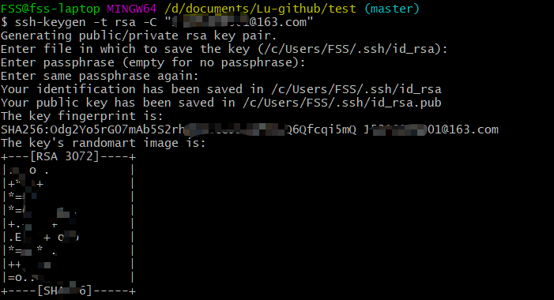
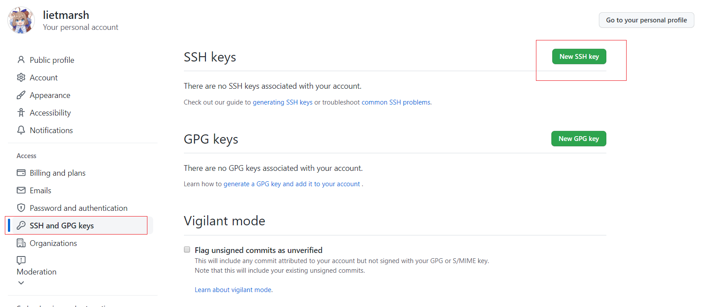
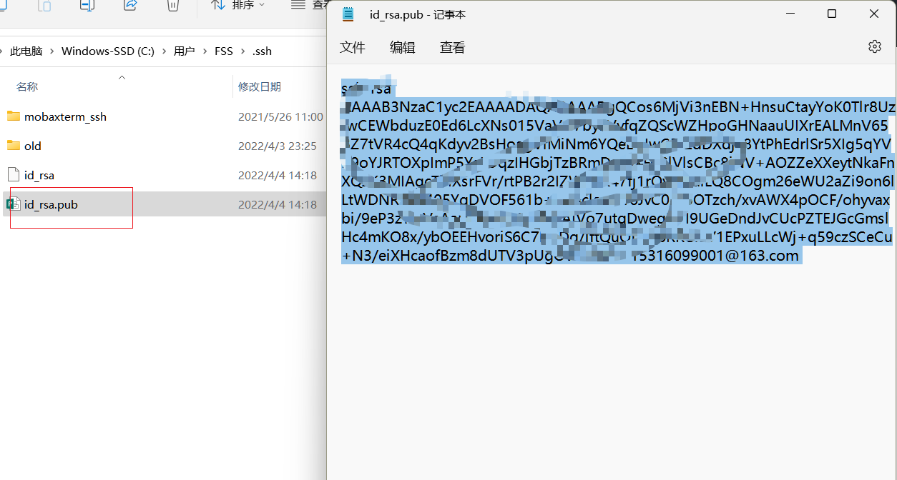

# Git上传本地文件方法
概要：总的流程是 创建本地仓库--连接远程仓库--add&commit--把项目push上去 四步。  
补充：当然，一两个文件的话，也可以直接在网页上右上角add file上传文件；另外也可以git clone远程仓库到本地修改后再push上去。  

 
1. 创建一个文件夹test1  
2. 进入文件夹，git bash here(此处的文件夹是我上传在annotation tools的处理xml标注文件的工具)（我是使用vscode写markdown，不知道有没有更方便的工具）  

 
3. 使用git init初始化此文件夹，通过git status查看状态   

 
4. （如果你有ssh key跳过这一步）创建ssh key链接本地与你的github。 ssh-keygen -t rsa -C "你的邮箱"，然后一路默认，不设密码。   

    
在你的github账号的setting中，选择SSH那个，然后用记事本打开你刚才生成的ssh key的pub，把里面的内容复制在add ssh key里面。名字随意起。  

 

 

 
5. 切换到分支main， git checkout -b main，因为组里的仓库默认branch是main 

 
6. 连接到远程仓库：git remote add origin https://github.com/Lugroup-lab/Annotation-tools.git ,然后合并本地与远端： git pull --rebase origin main。   

 

 
7. 通过git add 文件名字或者git add .（表示添加所有文件）添加文件，同样也可以用git status查看状态。这个时候你就已经将文件添加到了你的本地仓库。  

  
8. 使用git commit把项目提交至仓库  

 
9. 上传：git push origin main(如果为空项目用git push -u origin main初始化上传) 

 

  
