# 项目上传和应用教程
## 项目上传
### 1. 创建GitHub账号并加入（大家加入了肯定已经创建好了）
### 2. [安装Git客户端](安装git客户端)
### 3. 账户设置
打开git-bash.exe，在桌面快捷方式/开始菜单/安装目录中
因为Git是分布式版本控制系统，所以需要填写用户名和邮箱作为一个标识，用户和邮箱为你github注册的账号和邮箱  

### 4. [从本地上传已有项目](从本地上传目标.md)
1. 创建一个文件夹test  
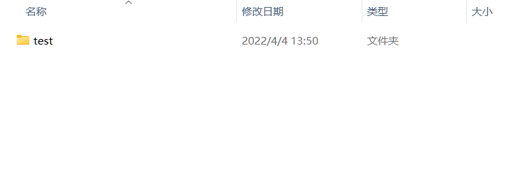  
2. 进入文件夹，git bash here(此处的images文件夹和git-upload.md是我本地用来写此教程的markdown文本)（我是使用vscode写markdown，不知道有没有更方便的工具）  
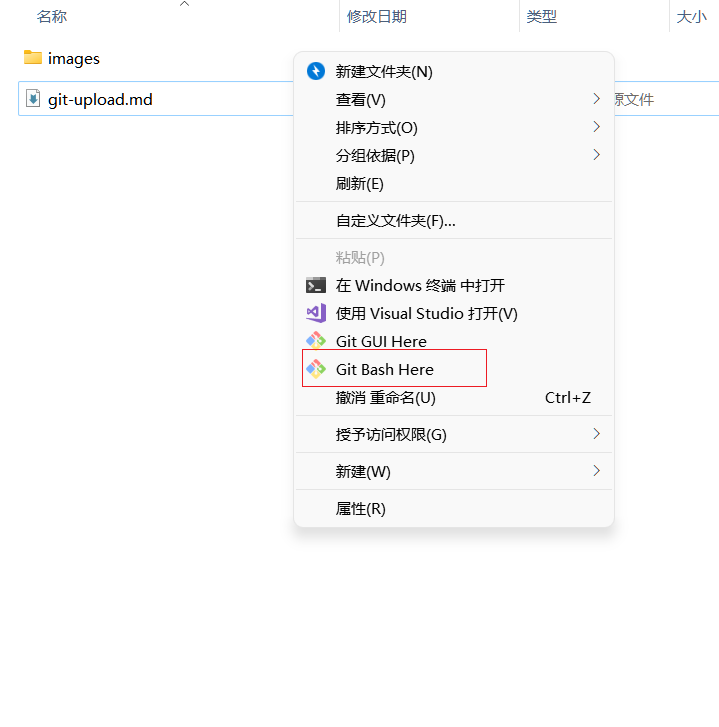  
3. 使用git init初始化此文件夹，通过git status查看状态  
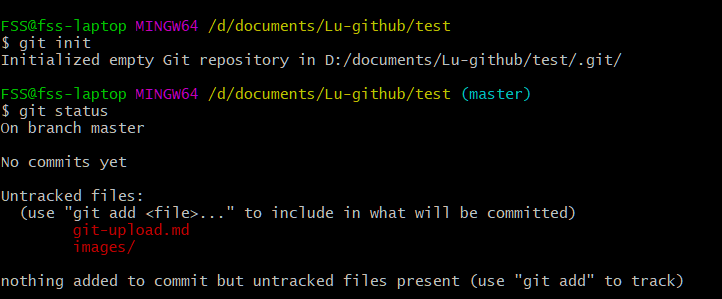  
3.1 补充：在这里切换分支到main  
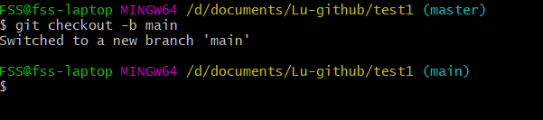  
4. 通过git add 文件名字或者git add .（表示添加所有文件）添加文件，同样也可以用git status查看状态。这个时候你就已经将文件添加到了你的本地仓库。  
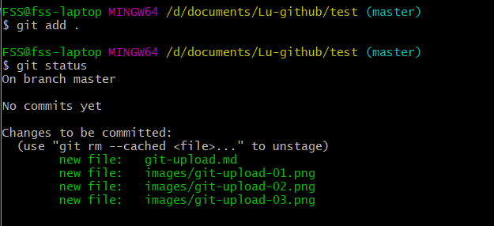  
5. 使用git commit把项目提交至仓库，然后本地的工作就结束了  
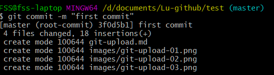  
6. 创建ssh key链接本地与你的github。 ssh-keygen -t rsa -C "你的邮箱"，然后一路默认，不设密码。  
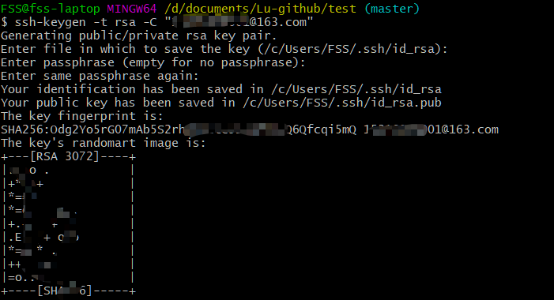  
在你的github账号的setting中，选择SSH那个，然后用记事本打开你刚才生成的ssh key的pub，把里面的内容复制在add ssh key里面。名字随意起。  
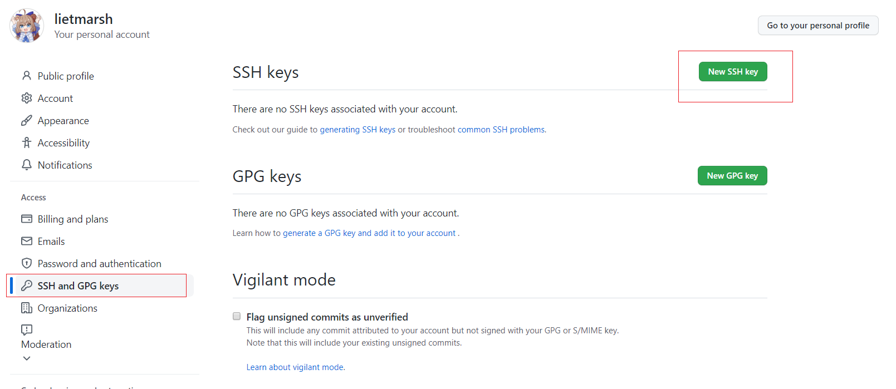  
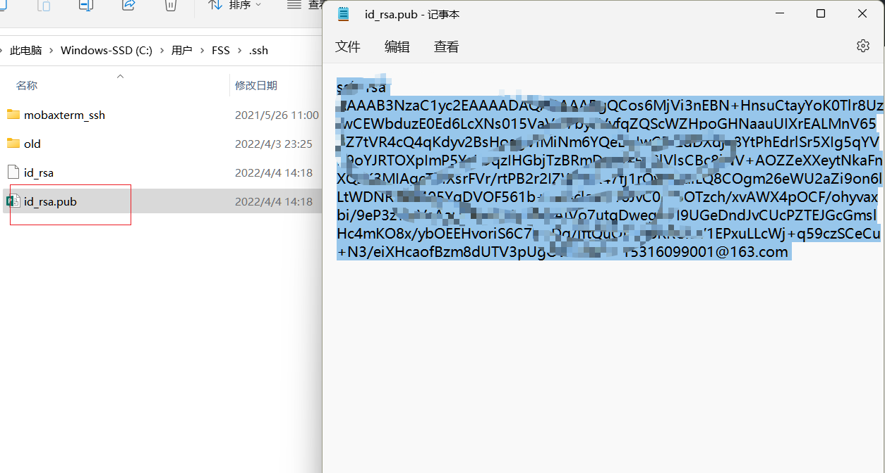  
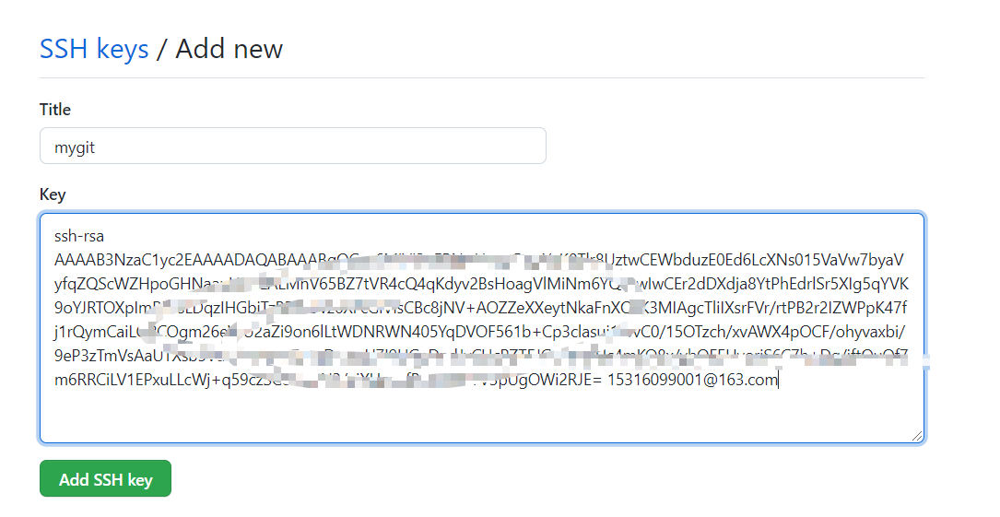  
7. 连接本地与仓库：git remote add origin https://github.com/Lugroup-lab/The-Announcement.git
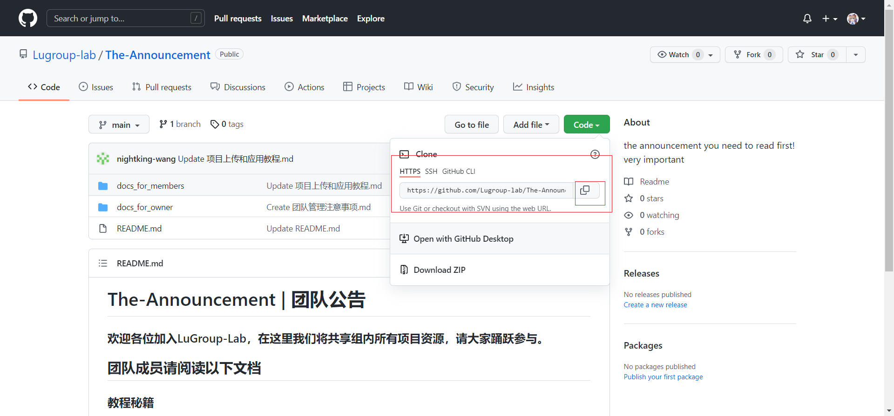  
8. 上传：（碎碎念：组里的现有的仓库默认分支都是main，所以最好在最开始的时候就把分支切换到main，在这里我创建一个分支fork_fss，git checkout -b fork_fss，然后重新来一遍add，commit，上传git push -u origin fork_fss）  
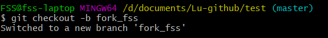  
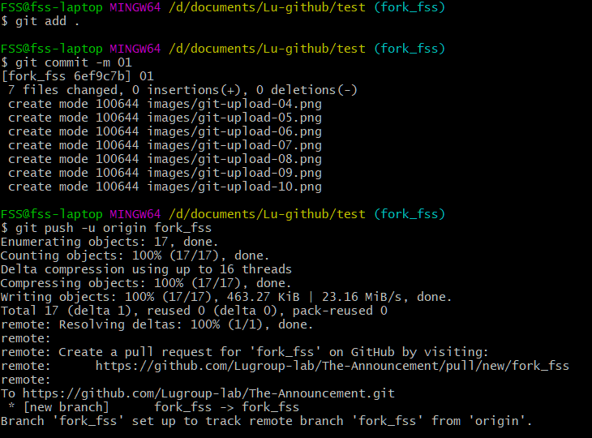  

### 5. 从自己的github上传（森森补充）

### 6. 从他人的github上传（森森补充）

### 7. 上传内容格式要求
#### - 代码
#### - 环境要求文档（requirements.txt)
#### - 技术说明文档（环境配置过程、代码调试过程）
#### - 数据（训练数据和运行结果）
#### - 模型和权重（models|weights）

### 8. 参考
- [github入门到上传本地项目](https://www.cnblogs.com/specter45/p/github.html)
- 

## 项目应用
### 1. 从团队仓库下载到本地（森森补充）
### 2. 从团队仓库进行fork到自己的github（森森补充）

## Developers
[Rui Wang](https://github.com/nightking-wang)  
[Sensen Fang](https://github.com/lietmarsh)  

